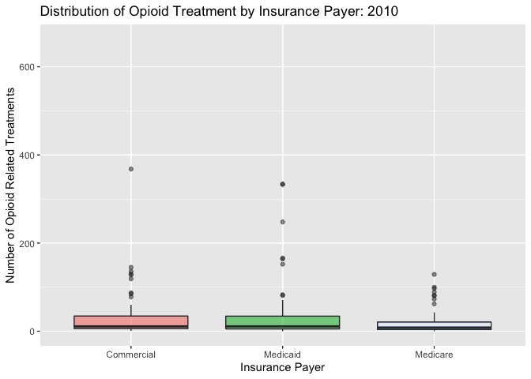

Animated boxplot of the number of opioid treatments by insurance provider:



Count of deaths by age group:

```{r setup, include=FALSE}
library(tidyverse)
library(viridis)
library(arcos)
library(readxl)
library(plotly)
knitr::opts_chunk$set(
	echo = TRUE,
	warning = FALSE,
	fig.width = 8, 
  fig.height = 6,
  out.width = "90%"
)
options(
  ggplot2.continuous.colour = "viridis",
  ggplot2.continuous.fill = "viridis"
)
scale_colour_discrete = scale_colour_viridis_d
scale_fill_discrete = scale_fill_viridis_d
theme_set(theme_minimal() + theme(legend.position = "bottom"))
```

```{r load, include=FALSE}

opioid_death_data = janitor::clean_names(read_csv('./opioid_related_deaths.csv'))

county_pop = janitor::clean_names(read_excel("./data/county_pop.xlsx"))

opioid_treatment_distance = janitor::clean_names(read_csv('./distance_to_treatment.csv'))

opioid_demographics = janitor::clean_names(read_csv("./opioid_demographics.csv"))

opioid_er_data = read_csv('./opioid_related_visits.csv') %>% 
  janitor::clean_names()
```

```{r, include=FALSE}
deaths_by_age = read_csv("./data/deaths_age_group.csv") %>% 
  janitor::clean_names() %>% 
  select(-region, -race_or_ethnicity, -sex) %>% 
  filter(age_group != "Total") %>% 
  group_by(year, age_group) %>% 
  summarize(
    count = sum(opioid_poisoning_deaths)
  ) %>% 
  ungroup()
```

```{r, message = FALSE, echo = FALSE}
deaths_by_age %>% 
  plot_ly(x = ~year, y = ~count, type = "scatter", mode = "lines+markers",
    color = ~factor(age_group), alpha = 0.5)
```

Count of deaths by race/ethnicity:

```{r load2, include=FALSE}
deaths_age_grp = read_csv("./data/deaths_age_group.csv") %>% 
  janitor::clean_names() %>% 
  pivot_wider(
    names_from = age_group,
    values_from = opioid_poisoning_deaths
  ) %>% 
  janitor::clean_names()


deaths_by_year = deaths_age_grp %>% 
  select(year, region, race_or_ethnicity, sex, total) %>% 
  group_by(year, race_or_ethnicity) %>% 
  summarize(
    count = sum(total)
  ) %>% 
  mutate(
    race_or_ethnicity = factor(race_or_ethnicity, levels = c("Not Stated", "Other Non Hispanic", "Black Non Hispanic", "Hispanic", "White Non Hispanic"))
  )
```

```{r, message = FALSE, echo = FALSE}
deaths_by_year %>% 
  plot_ly(x = ~year, y = ~count, type = "bar",
    color = ~race_or_ethnicity, alpha = 0.5)
```

Couth of deaths by sex

```{r death_sex, echo = FALSE, message = FALSE}

# type: plotly/ focus: summary-introduction
# looking at #death by sex over years
opioid_demographics %>% 
  filter(region == "NYC") %>% 
  group_by(year, sex) %>% 
  summarize(
    count = sum(opioid_poisoning_deaths)
  ) %>% 
  plot_ly(x = ~year, y = ~count, type = "bar",
          color = ~sex, alpha = 0.5)
```

Deaths per 10,000 by rural vs urban


```{r pharma data, include=FALSE}
prod_county = arcos::summarized_county_annual(state = "NY", key = "WaPo") %>% 
  janitor::clean_names()

county_pop = arcos::county_population(state = "NY", key = "WaPo") %>% 
  janitor::clean_names()
```


```{r data cleaning, include=FALSE}

# clean opioid death data #

opioid_death_data = opioid_death_data %>%
  filter(year >= 2010) %>% 
  mutate(county = recode(county, "Kings (Brooklyn)" = "Kings",
                         "New York (Manhattan)" = "New York",
                         "St Lawrence" = "St. Lawrence"))

# clean opioid er data #

opioid_er_data = opioid_er_data %>% 
  select(year, patient_county_name, rural_urban, payer, er_opioid, inpatient_total_opioid, er_inpatient_total_opioid, outpatient_opioid, overall_opioid) %>%
  rename(county = patient_county_name)

# Combine Data Sets #

opioid_total_data = left_join(opioid_er_data, opioid_death_data, by = c('county', 'year')) %>% 
  arrange(county, year)
```

```{r number of pills, include=FALSE}
# Top 20 Counties by Number of Prescription Opioids, 2006-2012 #
prod_county %>% 
  group_by(buyer_county) %>% 
  summarize(numpills = sum(count)) %>% 
  top_n(20, numpills) %>% 
  mutate(buyer_county = factor(buyer_county),
         buyer_county = fct_reorder(buyer_county, numpills)) %>% 
  ggplot(aes(x = buyer_county, y = numpills)) +
  geom_col() +
  xlab("County") +
  theme(axis.text.x = element_text(angle = 90, hjust = 1))
```

```{r pills per capita, include=FALSE}

# Pills bought by Pharmacies in Each county per Year #

pharma_df = left_join(prod_county, county_pop, by = c("buyer_county", "year")) %>% 
  select(county_name, year, count, population) %>% 
  rename(county = county_name,
         pills_bought = count) %>% 
  mutate(ppp = pills_bought/population)

```

```{r, include=FALSE}
# Top 20 Counties by Number of Pills Bought Per Person in 2012 #

pharma_df %>% 
  filter(year == 2012) %>% 
  mutate(county = factor(county),
         county = fct_reorder(county, ppp)) %>% 
  top_n(20, ppp) %>% 
  ggplot(aes(x = county, y = ppp)) +
  geom_col() +  
  theme(axis.text.x = element_text(angle = 90, hjust = 1)) +
  xlab("County") +
  ylab("Pills Bought per Capita, 2012")
```

```{r opioid total by year, include=FALSE}
sum_df <- opioid_total_data %>% 
  group_by(county, year, rural_urban) %>% 
  summarize(er_opioid = sum(er_opioid),
            inpatient_total_opioid = sum(inpatient_total_opioid),
            er_inpatient_total_opioid = sum(er_inpatient_total_opioid),
            outpatient_opioid = sum(outpatient_opioid),
            overall_opioid = sum(overall_opioid),
            opioid_poisoning_deaths = sum(opioid_poisoning_deaths)
  )
```

```{r rural v urban, include=FALSE}
join_df <- inner_join(sum_df, pharma_df, by = c("county", "year"))
```


```{r, include=FALSE}
join_df %>% 
  ggplot(aes(x = year, y = opioid_poisoning_deaths/population*10000, color = rural_urban)) +
  geom_point(alpha = 0.3) +
  geom_smooth(method = "lm", se = FALSE) +
  ylab("Opioid Deaths per 10,000") +
  scale_x_continuous(breaks = c(2010, 2011, 2012), labels = c("2010", "2011", "2012")) +
  labs(color = "Rural/Urban")
```

```{r, message = FALSE, echo = FALSE}
join_df %>% 
  ungroup() %>% 
  mutate(rural_urban = factor(rural_urban),
         year = factor(year)) %>% 
  ggplot(aes(x = year, y = opioid_poisoning_deaths/population*10000, fill = rural_urban)) +
  geom_boxplot(alpha = .5) +
  ylab("Opioid Deaths per 10,000") +
  scale_x_discrete(breaks = c(2010, 2011, 2012), labels = c("2010", "2011", "2012")) +
  labs(fill = "Rural/Urban")
```


