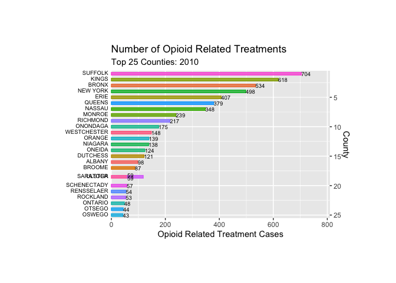

Animated boxplot of the number of opioid treatments by insurance provider:



Count of deaths by age group:

```{r setup, include=FALSE}
library(tidyverse)
library(viridis)
library(arcos)
library(readxl)
library(plotly)
knitr::opts_chunk$set(
	echo = TRUE,
	warning = FALSE,
	fig.width = 8, 
  fig.height = 6,
  out.width = "90%"
)
options(
  ggplot2.continuous.colour = "viridis",
  ggplot2.continuous.fill = "viridis"
)
scale_colour_discrete = scale_colour_viridis_d
scale_fill_discrete = scale_fill_viridis_d
theme_set(theme_minimal() + theme(legend.position = "bottom"))
```

```{r load, include=FALSE}

opioid_death_data = janitor::clean_names(read_csv('./opioid_related_deaths.csv'))

county_pop = janitor::clean_names(read_excel("./data/county_pop.xlsx"))

opioid_treatment_distance = janitor::clean_names(read_csv('./distance_to_treatment.csv'))
```

```{r, include=FALSE}
deaths_by_age = read_csv("./data/deaths_age_group.csv") %>% 
  janitor::clean_names() %>% 
  select(-region, -race_or_ethnicity, -sex) %>% 
  filter(age_group != "Total") %>% 
  group_by(year, age_group) %>% 
  summarize(
    count = sum(opioid_poisoning_deaths)
  ) %>% 
  ungroup()
```

```{r, message = FALSE, echo = FALSE}
deaths_by_age %>% 
  plot_ly(x = ~year, y = ~count, type = "scatter", mode = "lines+markers",
    color = ~factor(age_group), alpha = 0.5)
```

Count of deaths by race/ethnicity:

```{r load2, include=FALSE}
deaths_age_grp = read_csv("./data/deaths_age_group.csv") %>% 
  janitor::clean_names() %>% 
  pivot_wider(
    names_from = age_group,
    values_from = opioid_poisoning_deaths
  ) %>% 
  janitor::clean_names()


deaths_by_year = deaths_age_grp %>% 
  select(year, region, race_or_ethnicity, sex, total) %>% 
  group_by(year, race_or_ethnicity) %>% 
  summarize(
    count = sum(total)
  ) %>% 
  mutate(
    race_or_ethnicity = factor(race_or_ethnicity, levels = c("Not Stated", "Other Non Hispanic", "Black Non Hispanic", "Hispanic", "White Non Hispanic"))
  )
```

```{r, message = FALSE, echo = FALSE}
deaths_by_year %>% 
  plot_ly(x = ~year, y = ~count, type = "bar",
    color = ~race_or_ethnicity, alpha = 0.5)
```
