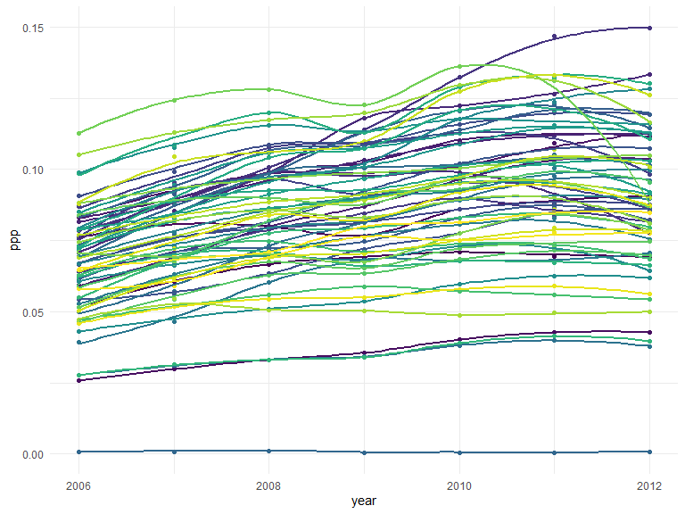
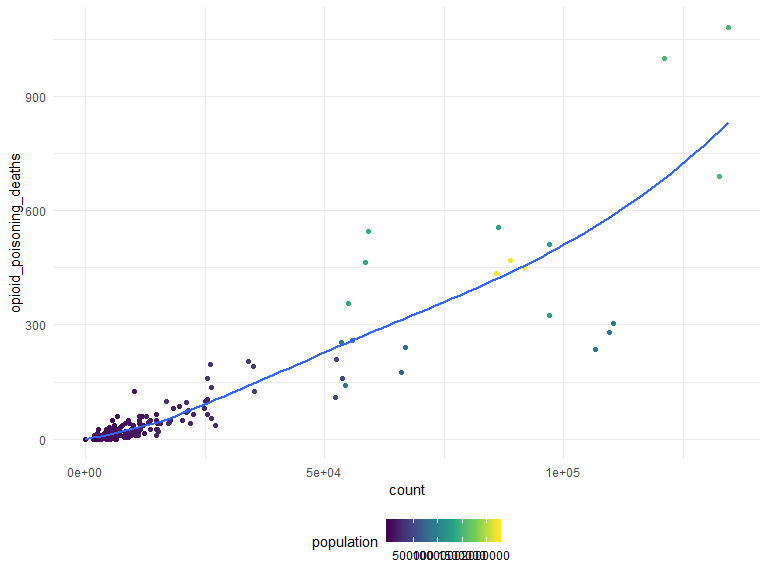

final\_project
================
Olivia Wagner
11/16/2019

``` r
opioid_death_data = janitor::clean_names(read_csv('./opioid_related_deaths.csv'))
```

    ## Parsed with column specification:
    ## cols(
    ##   Year = col_double(),
    ##   County = col_character(),
    ##   `Opioid Poisoning Deaths` = col_double()
    ## )

``` r
opioid_er_data = janitor::clean_names(read_csv('./opioid_related_visits.csv'))
```

    ## Parsed with column specification:
    ## cols(
    ##   .default = col_double(),
    ##   `Patient County Name` = col_character(),
    ##   `Rural/Urban` = col_character(),
    ##   Payer = col_character()
    ## )

    ## See spec(...) for full column specifications.

``` r
opioid_treatment_distance = janitor::clean_names(read_csv('./distance_to_treatment.csv'))
```

    ## Parsed with column specification:
    ## cols(
    ##   STATEFP = col_character(),
    ##   COUNTYFP = col_character(),
    ##   YEAR = col_double(),
    ##   INDICATOR = col_character(),
    ##   VALUE = col_double(),
    ##   STATE = col_character(),
    ##   STATEABBREVIATION = col_character(),
    ##   COUNTY = col_character()
    ## )

``` r
prod_county = arcos::summarized_county_annual(state = "NY", key = "WaPo") %>% 
  janitor::clean_names()

county_pop = arcos::county_population(state = "NY", key = "WaPo") %>% 
  janitor::clean_names()
```

``` r
# clean opioid death data #

opioid_death_data = opioid_death_data %>% 
  filter(year >= 2010) 

# clean opioid er data #

opioid_er_data = opioid_er_data %>% 
  select(year, patient_county_name, rural_urban, payer, er_opioid, inpatient_total_opioid, er_inpatient_total_opioid, outpatient_opioid, overall_opioid) %>%
  rename(county = patient_county_name)

# clean opioid treatment data #
# data is only for the year 2017#

opioid_treatment_distance %>% 
  filter(state == 'New York') %>%
  select(state, county, value) %>%
  rename(distance = value) 
```

    ## # A tibble: 62 x 3
    ##    state    county             distance
    ##    <chr>    <chr>                 <dbl>
    ##  1 New York Albany County          5.97
    ##  2 New York Allegany County       14.6 
    ##  3 New York Bronx County           0.32
    ##  4 New York Broome County          7.96
    ##  5 New York Cattaraugus County     9.86
    ##  6 New York Cayuga County         11.9 
    ##  7 New York Chautauqua County      8.15
    ##  8 New York Chemung County         6.53
    ##  9 New York Chenango County       11.6 
    ## 10 New York Clinton County        14.4 
    ## # ... with 52 more rows

``` r
# Combine Data Sets #

opioid_total_data = left_join(opioid_er_data, opioid_death_data, by = c('county', 'year')) %>% 
  arrange(county, year)

opioid_total_data %>% arrange(year, county) %>% print()
```

    ## # A tibble: 1,950 x 10
    ##     year county rural_urban payer er_opioid inpatient_total~
    ##    <dbl> <chr>  <chr>       <chr>     <dbl>            <dbl>
    ##  1  2010 Albany Urban       Medi~        13               14
    ##  2  2010 Albany Urban       Other         0                1
    ##  3  2010 Albany Urban       Medi~        20               11
    ##  4  2010 Albany Urban       Comm~        20                9
    ##  5  2010 Albany Urban       Unkn~         8                0
    ##  6  2010 Alleg~ Rural       Medi~         0                3
    ##  7  2010 Alleg~ Rural       Other         1                0
    ##  8  2010 Alleg~ Rural       Comm~         1                5
    ##  9  2010 Alleg~ Rural       Medi~         0                4
    ## 10  2010 Alleg~ Rural       Unkn~         2                0
    ## # ... with 1,940 more rows, and 4 more variables:
    ## #   er_inpatient_total_opioid <dbl>, outpatient_opioid <dbl>,
    ## #   overall_opioid <dbl>, opioid_poisoning_deaths <dbl>

``` r
prod_county %>% 
  group_by(buyer_county) %>% 
  summarize(nopills = sum(count)) %>% 
  arrange(desc(nopills))
```

    ## # A tibble: 62 x 2
    ##    buyer_county nopills
    ##    <chr>          <int>
    ##  1 SUFFOLK       870497
    ##  2 ERIE          702107
    ##  3 NASSAU        632906
    ##  4 NEW YORK      604129
    ##  5 KINGS         600261
    ##  6 QUEENS        544853
    ##  7 MONROE        422297
    ##  8 WESTCHESTER   357865
    ##  9 BRONX         342213
    ## 10 ONONDAGA      339065
    ## # ... with 52 more rows

``` r
pharma_df = left_join(prod_county, county_pop, by = c("buyer_county", "year")) %>% 
  select(county_name, name, year, count, population) %>% 
  rename(county = county_name) %>% 
  mutate(ppp = count/population)
```

``` r
pharma_df %>% 
  ggplot(aes(x = year, y = ppp, color = county)) +
  geom_point() +
  geom_smooth(se = FALSE) +
  theme(legend.position = "none")
```

    ## `geom_smooth()` using method = 'loess' and formula 'y ~ x'



``` r
sum_df <- opioid_total_data %>% 
  group_by(county, year) %>% 
  summarize(er_opioid = sum(er_opioid),
            inpatient_total_opioid = sum(inpatient_total_opioid),
            er_inpatient_total_opioid = sum(er_inpatient_total_opioid),
            outpatient_opioid = sum(outpatient_opioid),
            overall_opioid = sum(overall_opioid),
            opioid_poisoning_deaths = sum(opioid_poisoning_deaths)
  )
```

``` r
death_sales_df <- inner_join(sum_df, pharma_df, by = c("county", "year")) %>% 
  select(-name) %>% 
  ungroup() %>% 
  mutate(county = as.factor(county),
         year = as.factor(year),
         deaths_per_cap = opioid_poisoning_deaths/population)
```

## model building is fun

``` r
fit1 <- lm(deaths_per_cap ~ ppp, data = death_sales_df)
fit2 <- lm(deaths_per_cap ~ . -er_inpatient_total_opioid -population, data = death_sales_df)
fit3 <- lm(deaths_per_cap ~ count * population, data = death_sales_df)
fit4 <- lm(deaths_per_cap ~ count + population, data = death_sales_df)
```

``` r
summary(fit1)
summary(fit2)
summary(fit3)
summary(fit4)
```

``` r
model1 <- step(fit1)
```

    ## Start:  AIC=-2952.46
    ## deaths_per_cap ~ ppp
    ## 
    ##        Df  Sum of Sq        RSS     AIC
    ## <none>               7.2674e-06 -2952.5
    ## - ppp   1 2.9524e-07 7.5627e-06 -2947.5

``` r
anova(fit3, fit1)
```

``` r
death_sales_df %>% 
  ggplot(aes(x = count, y = opioid_poisoning_deaths, color = population)) +
  geom_point() +
  geom_smooth(se = FALSE)
```

    ## `geom_smooth()` using method = 'loess' and formula 'y ~ x'



``` r
anova(fit1)
```
