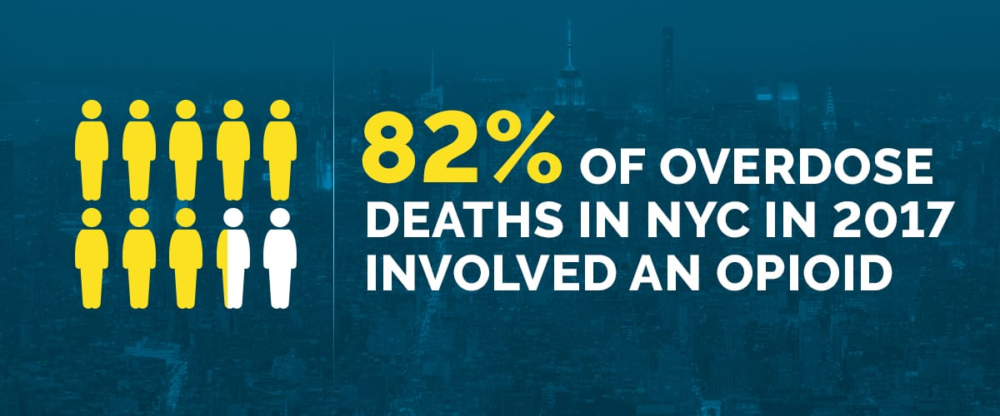

## Motivation

The opioid epidemic is a national crisis. Every day in the U.S., more than 130 people die from an opioid overdose. The importance of finding a solution to the opioid epidemic is indisputable.  
  
In this project, we aim to explore trends in the opioid crisis from a demographic standpoint, as well as to investigate the effectiveness of different public health and policy efforts. Through this data-grounded exploration, we hope to elucidate the role that public health can play in alleviating the epidemic.

## Data

We explore 4 datasets, detailed below, for our analyses regarding the opioid crisis in NYC specifically.

* https://opioid.amfar.org/about/sources

* https://health.data.ny.gov

* https://catalog.data.gov

## Research Questions

* Is there a relationship between distance to nearest substance abuse facility and opioid deaths?

* Is there a relationship between medication collection box locations and opioid overdoses?

* What is the trend over time in opioid deaths by age and race?

* Does the higher percent of drug treatment paid by medicare result in lower drug-related death?

## Findings

We found that there is no distinct relationship between the distance to a treatment facility and the proportion of opioid deaths. This is likely because of the presence of other unmeasured variables, such as the fact that treatment facilities are placed in higher risk areas, or urban areas that have a higher proportion of young people. Additionally, we found that the majority of opioid deaths from 2003 to 2017 are in white males. 

## Website Overview

* Animated Graphs

* Plotly & Plots

* Screencast

* Report
