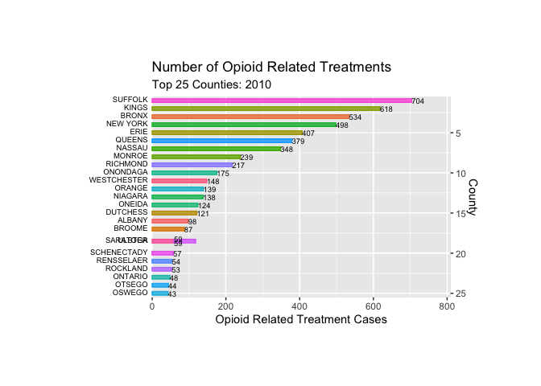
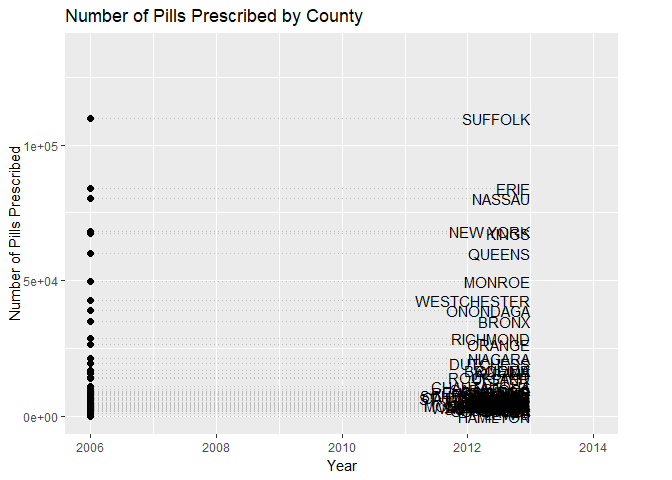

---
title: "Trends"
output: html_document
--- 

We observe county-specific trends to better understand how the opioid epidemic differs by area in New York.

## Death Rate by County (2010 to 2017)

Looking at the death rate by county from 2010 to 2017, we see that Sullivan county has the highest rate of opioid related deaths. Schuyler county, which is very far upstate, has the lowest rate of opioid related deaths. 

```{r, include=FALSE}
library(tidyverse)
library(viridis)
library(arcos)
library(plotly)

knitr::opts_chunk$set(
	echo = TRUE,
	warning = FALSE,
	fig.width = 8,
  fig.height = 6,
  out.width = "90%"
)
options(
  ggplot2.continuous.colour = "viridis",
  ggplot2.continuous.fill = "viridis"
)
scale_colour_discrete = scale_colour_viridis_d
scale_fill_discrete = scale_fill_viridis_d
theme_set(theme_minimal() + theme(legend.position = "bottom"))
```

```{r, include=FALSE}
# data import

opioid_death_data = janitor::clean_names(read_csv('./data/opioid_related_deaths_2.csv'))

opioid_treatment_distance = janitor::clean_names(read_csv('./data/distance_to_treatment.csv'))

opioid_demographics = janitor::clean_names(read_csv("./data/opioid_demographics.csv"))

opioid_er_data = read_csv('./data/opioid_related_visits.csv') %>% 
  janitor::clean_names()
```

```{r, include=FALSE}

prod_county = arcos::summarized_county_annual(state = "NY", key = "WaPo") %>% 
  janitor::clean_names()

county_pop = arcos::county_population(state = "NY", key = "WaPo") %>% 
  janitor::clean_names()
```

```{r, include=FALSE}

# clean opioid death data #

opioid_death_data = opioid_death_data %>% 
  filter(year >= 2010) 

# clean opioid er data #

opioid_er_data = opioid_er_data %>% 
  select(year, patient_county_name, rural_urban, payer, er_opioid, inpatient_total_opioid, er_inpatient_total_opioid, outpatient_opioid, overall_opioid) %>%
  rename(county = patient_county_name)

# clean opioid treatment data #
# data is only for the year 2017#

opioid_treatment_distance %>% 
  filter(state == 'New York') %>%
  select(state, county, value) %>%
  rename(distance = value) 
```

```{r, message = FALSE, echo = FALSE}

# "total_death df": summing sup the death of all years in each county
# "total_pop": total opulation in each county
# "total_death_pop": joining these two df's and adjusting number of death for population of each county
# creating bar plotly

total_death = opioid_death_data %>% 
  group_by(county) %>% 
  summarize(
    death_sum = sum(opioid_poisoning_deaths)
  ) %>% 
  mutate(
    county = toupper(county)
  )

total_pop = county_pop %>% 
  select (buyer_county, year, population) %>% 
  rename(county = buyer_county) %>% 
  group_by(county) %>% 
  summarize(
    
    total_pop = sum(population)
  )

total_death_pop = left_join(total_death, total_pop) %>% 
  mutate(
    county = factor(county),
    death_pop = death_sum/total_pop,
    county = fct_reorder(county, death_pop)
  )

total_death_pop %>% 
  plot_ly(
    x = ~county, y = ~death_pop, split = ~county,
    type = 'bar', alpha = 0.5
  ) %>% 
    layout(
    xaxis = list(
      title = "County"),
    yaxis = list(
      title = "Death per 1 Million People")
  )
```

## Opioid Related Treatments by County (2010 to 2012)

We can observe the number of opioid related treatments by county from 2010 to 2012. Suffolk, Kings, and Bronx counties remain the top 3 between 2010 and 2012. However, we do see movement between other counties. In particular, in 2011, Erie county surpasses New York county, and there is a lot of exchange between the lower counties.



## Pills Prescribed by County (2006 to 2013)

We can see the trend in number of pills prescribed by county from 2006 to 2013. Suffolk and Erie counties remain the highest throughout the time period observed, while Nassau, New York, and Queens counties exchange places as the next highest. It is interesting to notice that we see Suffolk, New York, and Erie as having high number of opioid related treatments in the graph above. This suggests that there may be some relationship between number of pills prescribed and number of opioid related treatments. 




