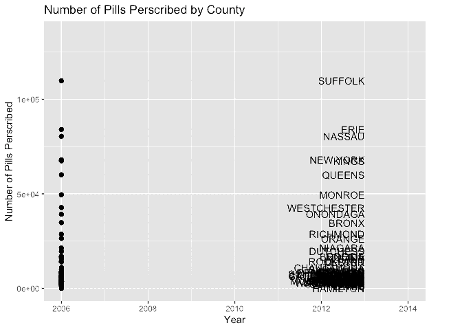

## Death Rate by County

```{r, include=FALSE}
library(tidyverse)
library(viridis)
library(arcos)
library(plotly)

knitr::opts_chunk$set(
	echo = TRUE,
	warning = FALSE,
	fig.width = 8,
  fig.height = 6,
  out.width = "90%"
)
options(
  ggplot2.continuous.colour = "viridis",
  ggplot2.continuous.fill = "viridis"
)
scale_colour_discrete = scale_colour_viridis_d
scale_fill_discrete = scale_fill_viridis_d
theme_set(theme_minimal() + theme(legend.position = "bottom"))
```

```{r, include=FALSE}
# data import

opioid_death_data = janitor::clean_names(read_csv('./opioid_related_deaths.csv'))

opioid_er_data = janitor::clean_names(read_csv('./opioid_related_visits.csv'))

opioid_treatment_distance = janitor::clean_names(read_csv('./distance_to_treatment.csv'))

opioid_demographics = janitor::clean_names(read_csv("./opioid_demographics.csv"))
```

```{r, include=FALSE}

prod_county = arcos::summarized_county_annual(state = "NY", key = "WaPo") %>% 
  janitor::clean_names()

county_pop = arcos::county_population(state = "NY", key = "WaPo") %>% 
  janitor::clean_names()
```

```{r, include=FALSE}

# clean opioid death data #

opioid_death_data = opioid_death_data %>% 
  filter(year >= 2010) 

# clean opioid er data #

opioid_er_data = opioid_er_data %>% 
  select(year, patient_county_name, rural_urban, payer, er_opioid, inpatient_total_opioid, er_inpatient_total_opioid, outpatient_opioid, overall_opioid) %>%
  rename(county = patient_county_name)

# clean opioid treatment data #
# data is only for the year 2017#

opioid_treatment_distance %>% 
  filter(state == 'New York') %>%
  select(state, county, value) %>%
  rename(distance = value) 
```

```{r, message = FALSE, echo = FALSE}

# "total_death df": summing sup the death of all years in each county
# "total_pop": total opulation in each county
# "total_death_pop": joining these two df's and adjusting number of death for population of each county
# creating bar plotly

total_death = opioid_death_data %>% 
  group_by(county) %>% 
  summarize(
    death_sum = sum(opioid_poisoning_deaths)
  ) %>% 
  mutate(
    county = toupper(county)
  )

total_pop = county_pop %>% 
  select (buyer_county, year, population) %>% 
  rename(county = buyer_county) %>% 
  group_by(county) %>% 
  summarize(
    
    total_pop = sum(population)
  )

total_death_pop = left_join(total_death, total_pop) %>% 
  mutate(
    county = factor(county),
    death_pop = death_sum/total_pop,
    county = fct_reorder(county, death_pop)
  )

total_death_pop %>% 
  plot_ly(
    x = ~county, y = ~death_pop, split = ~county,
    type = 'bar', alpha = 0.5
  )
```

## Opioid Related Treatments by County

Number of opioid related treatments by county in 2010


## Pills Prescribed by County

Number of pills prescribed by county from 2006 to 2013




